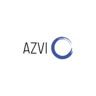

# Proyecto del grupo AZVI 🚀

_Repositorio del grupo 1 para proyecto integrador de Digital House._

## ¿Que es AZVI y que brinda? 📋

_AZVI brindará una conexión entre proveedores de servicios y sus potenciales clientes._
_¿Qué queremos lograr? Reemplazar el boca-en-boca por un nuevo paradigma, lograr que nuestros clientes tengan siempre a mano y en cualquier lugar un listado de proveedores de servicios (plomeros, gasistas, electricistas, pintores ¡y muchos más!)_
_Cada uno con sus respectivas calificaciones por trabajos previos, con comentarios y fotos incluidas, referencias de precios entre distintos proveedores (para poder filtrar búsqueda según presupuesto)_

##### En resumen:
- Cada proveedor podrá publicar y anunciar su servicio
- Cada potencial cliente, podrá, sin registrarse, ver los servicios que incluye la plataforma. Registrándose accederá a los datos completos, calificaciones previas, la posibilidad de adquirir ese servicio y contactarse con el proveedor. Previamente podrá realizar consultas sobre presupuestos para fijar el detalle del trabajo por escrito.

## Integrantes ✒️

_Somos estudiantes de Programación web Full Stack en_ [_Digital House Argentina_](https://www.digitalhouse.com/ar/curso/programacion-web-full-stack)

* [**Tomas Vergara**](https://github.com/tomasVergara14)
* [**Tomas Ibañez**](https://github.com/Tomi1608)
* [**Joaquin Zuazo**](https://github.com/joaquinzuazo)
* [**Facundo Aquino**](https://github.com/facundoaquino)

## Sitios de referencia 📖

_Tomamos como referencia estas distintas webs, dado que encontramos una buena experiencia de usuario en la navegación, comodidad de registro y adquisición de productos._

- [Tienda Mia](https://tiendamia.com/ar/)
- [Amazon](https://www.amazon.com/)
- [Farmacity](https://www.farmacity.com)
- [E-bay](https://www.ebay.com/)
- [Mercado Libre](https://www.mercadolibre.com.ar)
- [RapiHogar](https://www.rapihogar.com.ar/)

---
