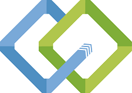

 
# AZVI
---

# Proyecto del grupo AZVI 🚀

_Retrospectiva de estrella de mar._

## Start Doing (comenzar a hacer) 📋

- _Nos planteamos en el grupo la idea de que cada servicio adquirido pueda ser calificado por el usuario, con una puntuación por cada ítem (precio, calidad, rapidez) y con la adición de fotos (si corresponde) o cualquier otro dato extra que sume como opinión del proveedor._
- _La búsqueda debe poder realizarse sin estar registrado, con un filtrado por categorías y localidades._
- _En la medida que podamos lograrlo, la segunda idea principal era que el usuario proveedor de servicios pueda autoadministrar sus publicaciones. En este caso, de no poder lograrlo las publicaciones las realizaran los administradores del sitio._
- _Estos puntos deben estar claros en la actualidad para poder avanzar con el sprint-2._

## More of (hacer mas) 📋

- _Refinaremos los wireframes a fin de lograr una mejor visual y usabilidad._
- _Volveremos a plantear y redefinir algunos detalles sobre las pautas del sprint1, esto nos permitirá concentrarnos con más atención en los sprint siguientes._

## Keep Doing (continuar haciendo) 📋

- _La idea principal y el mapa conceptual del desarrollo web._

## Less of (hacer menos) 📋

- _Definir concretamente si sumaremos la autogestion por parte de cada usuario (proveedor) o creemos que no nos aporta valor._

## Stop Doing (dejar de hacer) 📋

- _La idea principal, ser un nexo entre clientes y proveedores de servicios, es el punto fuerte del proyecto, aunque debemos acomodar algunas formas de como llevarlo a cabo, estamos bien enfocados._

---
